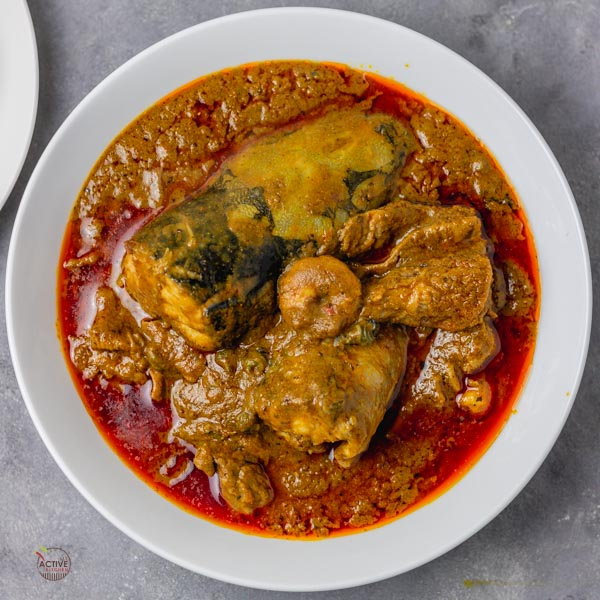

## About
Task is to create a simple recipe page of my favorite meal using basic html only.

The recipe page should consist of the following:
- The name of the food/meal
- About the food (origin etc)
- A tabular list of ingredients needed to prepare the meal and their measurements
- A list of steps/methods to prepare the meal
- A list of food photos (4-6 of them), each of them on a card

## Task link
https://github.com/Busybeebee11/favmeal-task

## Live link
https://busybeebee11.github.io/favmeal-task/

## Images

